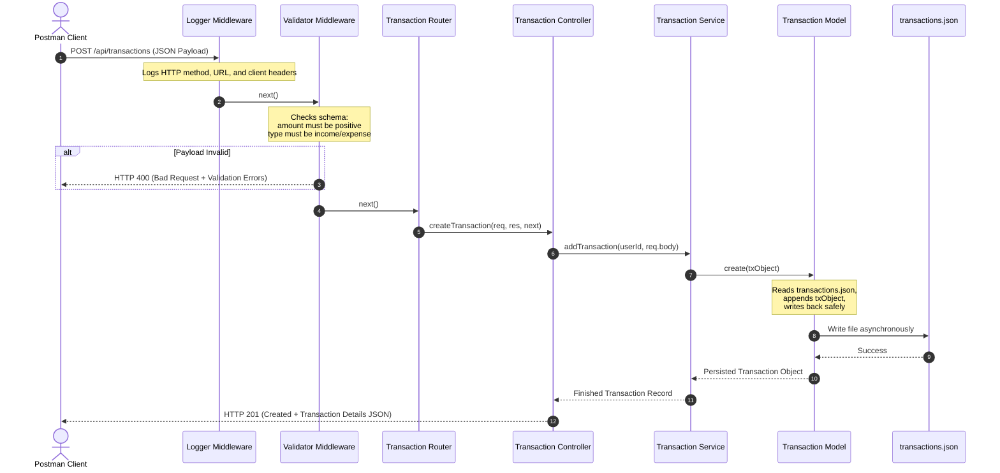

# Detailed Architecture: FinEdge – Personal Finance & Expense Tracker API

This document details the software architecture, modular component design, file-based data schemas, request-response lifecycles, and interface designs for the FinEdge Personal Finance & Expense Tracker API backend.

---

## 1. System Overview

FinEdge is designed around a **Three-Tier Service-Repository Architecture** built on **Node.js** and **Express.js**. This design decouples HTTP delivery mechanics from business workflows and storage engines, ensuring scalability, ease of testability, and clean boundaries.

### Core Architecture Characteristics:
1. **Asynchronous Framework**: Leveraging Node's event-driven, non-blocking model for async file operations (`fs/promises`).
2. **Layered MVC/Three-Tier Separation**:
   - **Routes/Controllers**: Expose REST endpoints, handle incoming requests, and return standardized JSON HTTP responses.
   - **Services**: Contain pure business logic (validation, calculation of metrics, data transformations).
   - **Models**: Control data persistence. Since we use file-based JSON persistence, the models encapsulate reading and writing to local files with lock-safety and async operations.
3. **Robust Middleware Interception**: Request payloads are validation-checked, execution metrics are logged, and errors are handled uniformly in a central class.

---

## 2. Architecture Component Diagram

The following diagram illustrates how requests flow from clients through Express middlewares and routers down to services, helpers, and file storage.

```mermaid
graph TB
    subgraph Client Layer
        Postman[Postman / Client UI]
    end

    subgraph Middleware Layer (Express Interceptors)
        Logger[Logger Middleware]
        Validator[Validator Middleware]
    end

    subgraph Orchestration & Routing Layer
        Router[Express Routers]
        UserController[User Controller]
        TxController[Transaction Controller]
    end

    subgraph Business Logic & Utilities
        UserService[User Service]
        TxService[Transaction Service]
        Analytics[Analytics Utility]
        AIHelper[AI Insights Helper]
    end

    subgraph Data Access Layer (Models)
        UserModel[User Model]
        TxModel[Transaction Model]
    end

    subgraph Persistent Storage
        UserDB[(users.json)]
        TxDB[(transactions.json)]
    end

    subgraph Global Exception Handling
        ErrMiddleware[Centralized Error Middleware]
    end

    %% Routing Flow
    Postman -->|1. HTTP Requests| Logger
    Logger -->|2. Next| Validator
    Validator -->|3. Next| Router
    
    %% Controller Routing
    Router -->|User Routes| UserController
    Router -->|Transaction Routes| TxController
    
    %% Logic Orchestration
    UserController --> UserService
    TxController --> TxService
    
    %% Calculations & Helper integrations
    TxService --> Analytics
    TxService --> AIHelper
    
    %% Database / File Layer
    UserService --> UserModel
    TxService --> TxModel
    
    UserModel -->|Async Read/Write| UserDB
    TxModel -->|Async Read/Write| TxDB

    %% Error Handling Flow
    Validator -.->|Validation Failures| ErrMiddleware
    UserController -.->|Exceptions Caught| ErrMiddleware
    TxController -.->|Exceptions Caught| ErrMiddleware
    ErrMiddleware -->|4. Standardized JSON Error Response| Postman
```

---

## 3. Data Schema & File Storage

Data is stored persistently in local JSON files inside the `src/data/` folder. The Models are responsible for validating records before write-back.

### 3.1. User Schema (`users.json`)
Represents registered accounts. The passwords are securely stored as cryptographic hashes (e.g., bcrypt).

| Property Name | Data Type | Database Constraint / Rules | Description |
| :--- | :--- | :--- | :--- |
| `id` | `UUID (string)` | Primary Key, Auto-generated | Unique identifier for each user. |
| `username` | `string` | Unique, Required, min 3 chars | User's display name. |
| `email` | `string` | Unique, Format: email, Required | Email address (used for authentication). |
| `password` | `string` | Cryptographic hash, Required | Hashed representation of the password. |
| `createdAt` | `string (ISO)`| Default: Current Timestamp | Time the account was registered. |

### 3.2. Transaction Schema (`transactions.json`)
Represents financial entries logged by users.

| Property Name | Data Type | Database Constraint / Rules | Description |
| :--- | :--- | :--- | :--- |
| `id` | `UUID (string)` | Primary Key, Auto-generated | Unique identifier for the transaction. |
| `userId` | `UUID (string)` | Foreign Key -> `users.id` | The owner of the transaction record. |
| `type` | `string` | Enum: `['income', 'expense']` | Indication of transaction cashflow direction. |
| `category` | `string` | Required (e.g., food, utilities, rent, salary) | Grouping for analytics summaries. |
| `amount` | `number` | Required, Float > 0 | Amount of money involved. |
| `description`| `string` | Optional (default: `""`) | Optional context/notes on the expense. |
| `date` | `string (ISO)`| Default: Current Timestamp | Date the transaction took place. |
| `createdAt` | `string (ISO)`| Default: Current Timestamp | Database record creation timestamp. |

---

## 4. Component Interface Design

Below are the class skeletons and signatures implementing the FinEdge modules.

### 4.1. Models Layer

Encapsulates the asynchronous retrieval and locking of local data.

#### `userModel.js`
```javascript
class UserModel {
  /**
   * Reads all users from data/users.json.
   * @returns {Promise<Array<Object>>}
   */
  static async findAll() {}

  /**
   * Finds user by email or username.
   * @param {string} email 
   * @returns {Promise<Object|null>}
   */
  static async findByEmail(email) {}

  /**
   * Saves a new user record.
   * @param {Object} userData 
   * @returns {Promise<Object>} The created user record.
   */
  static async create(userData) {}
}
```

#### `transactionModel.js`
```javascript
class TransactionModel {
  /**
   * Reads all transactions from data/transactions.json.
   * @returns {Promise<Array<Object>>}
   */
  static async findAll() {}

  /**
   * Retrieves all transactions associated with a userId.
   * @param {string} userId 
   * @returns {Promise<Array<Object>>}
   */
  static async findByUserId(userId) {}

  /**
   * Creates and persists a transaction record.
   * @param {Object} txData 
   * @returns {Promise<Object>}
   */
  static async create(txData) {}

  /**
   * Updates an existing transaction record by ID.
   * @param {string} id 
   * @param {Object} updateData 
   * @returns {Promise<Object|null>}
   */
  static async update(id, updateData) {}

  /**
   * Deletes a transaction record by ID.
   * @param {string} id 
   * @returns {Promise<boolean>} True if deleted, false otherwise.
   */
  static async delete(id) {}
}
```

---

### 4.2. Services Layer

Encapsulates core validations, hashing logic, and calculations.

#### `userService.js`
```javascript
class UserService {
  /**
   * Registers a new user. Performs email uniqueness validation and password hashing.
   * @param {string} username 
   * @param {string} email 
   * @param {string} password 
   * @returns {Promise<Object>} User details (excluding password).
   */
  static async registerUser(username, email, password) {}

  /**
   * Validates user credentials.
   * @param {string} email 
   * @param {string} password 
   * @returns {Promise<Object>} Session or JWT details.
   */
  static async authenticateUser(email, password) {}
}
```

#### `transactionService.js`
```javascript
class TransactionService {
  /**
   * Creates a transaction.
   * @param {string} userId
   * @param {Object} data 
   */
  static async addTransaction(userId, data) {}

  /**
   * Fetches user's transactions with optional filters.
   * @param {string} userId
   * @param {Object} filters (category, type, date range)
   */
  static async getUserTransactions(userId, filters) {}

  /**
   * Computes financial summaries and alerts using the Analytics utility.
   * @param {string} userId 
   * @returns {Promise<Object>} (totalIncome, totalExpenses, savings, insights)
   */
  static async getFinancialSummary(userId) {}
}
```

---

### 4.3. Middleware Layer

#### `errorHandler.js`
Centralized error handler using standard operational error class schemas.

```javascript
class AppError extends Error {
  constructor(message, statusCode) {
    super(message);
    this.statusCode = statusCode;
    this.status = `${statusCode}`.startsWith('4') ? 'fail' : 'error';
    this.isOperational = true;
    Error.captureStackTrace(this, this.constructor);
  }
}

// Global Error Handler Middleware
const errorHandler = (err, req, res, next) => {
  err.statusCode = err.statusCode || 500;
  err.status = err.status || 'error';

  res.status(err.statusCode).json({
    status: err.status,
    message: err.message,
    stack: process.env.NODE_ENV === 'development' ? err.stack : undefined
  });
};
```

---

## 5. End-to-End HTTP Request Flow

### Scenario: Creating an Expense Transaction (`POST /api/transactions`)



---

## 6. Helper & Analytics Core Logic

### 6.1. Analytics Engine (`src/utils/analytics.js`)
Calculates the basic financial summaries:
- **Total Income**: Sum of all transactions where `type === 'income'`.
- **Total Expenses**: Sum of all transactions where `type === 'expense'`.
- **Net Balance**: `Total Income - Total Expenses`.
- **Category Summary**: An aggregated dictionary (e.g., `{ "food": 500, "rent": 1200 }`) indicating spending per category.

### 6.2. AI Insights Engine (`src/utils/aiHelper.js`)
Generates logical rules or LLM prompts for monthly insights. The engine looks for financial patterns:
- **Budget Breaches**: Flagging categories where spending exceeds historical or predetermined margins.
- **Savings Ratio Check**: Alerting the user if expenses exceed 70% of total income.
- **Anomalous Spikes**: Identifying sudden surges in utility bills or leisure expenses.

---

## 7. API Routing Interface

### 7.1. Authentication Routes
- `POST /api/users/register` - Registers a new user.
- `POST /api/users/login` - Authenticates user credentials.

### 7.2. Transaction Routes
- `GET /api/transactions` - Returns transactions for authenticated user (supports pagination & query filters).
- `POST /api/transactions` - Adds a new transaction record (income/expense).
- `PUT /api/transactions/:id` - Edits a transaction.
- `DELETE /api/transactions/:id` - Deletes a transaction.
- `GET /api/transactions/summary` - Provides calculations on category spend, totals, and budget analysis.
