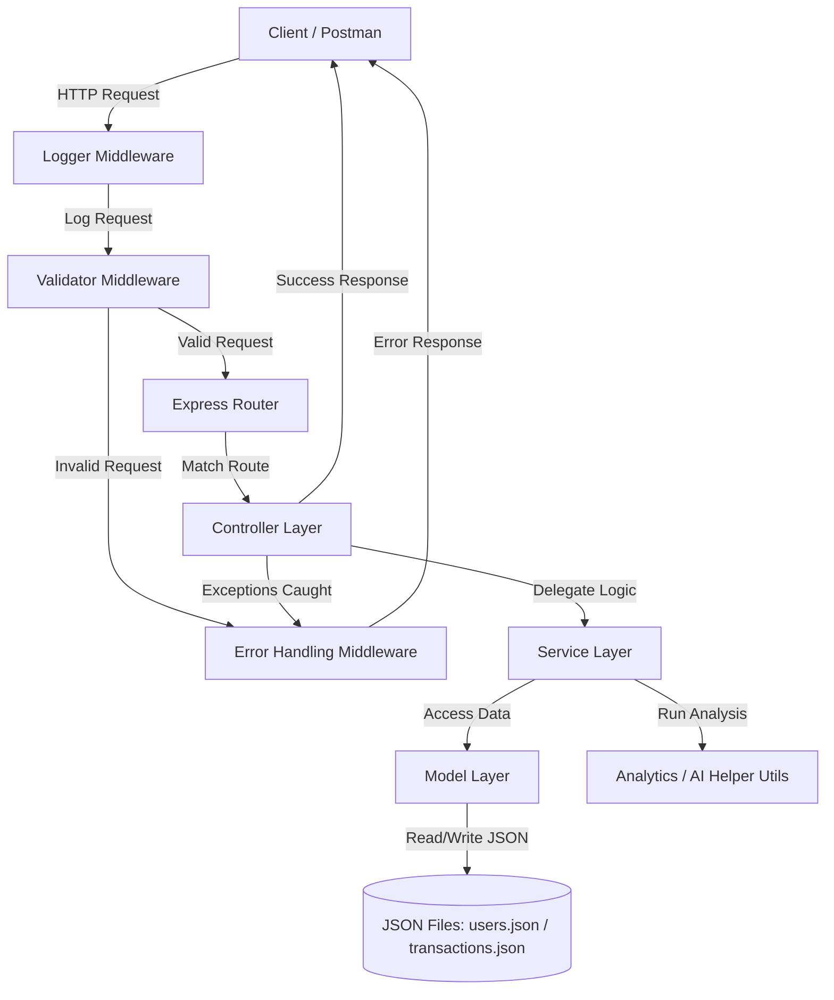

# FinEdge – Personal Finance & Expense Tracker API

## Project Overview & Context

Managing personal finances is a vital yet challenging aspect of modern life. With the rise of cashless transactions, digital wallets, monthly subscriptions, and multiple bank accounts, individuals frequently struggle to track their cash flows. Many resort to manual spreadsheets or physical notebooks, which are tedious to maintain, prone to human error, and do not offer real-time updates or automated classification.

**FinEdge** is a RESTful API backend for a personal finance tracker built using **Node.js** and **Express**. It aims to demonstrate asynchronous programming, a clean modular architecture, and industry-standard REST design principles. By utilizing FinEdge, users can create and manage their accounts, log income and expenses, view structured financial summaries, and obtain monthly insights to make informed, data-driven decisions about their spending.

---

## The Problem We Are Solving

1. **Fragmentation of Financial Data**: People spend money across multiple channels (debit/credit cards, UPI, cash), making it difficult to maintain a single source of truth for their financial state.
2. **High Friction in Manual Tracking**: Bookkeeping is often abandoned because manually calculating category-wise distributions, savings rates, and budget margins is exhausting.
3. **Monolithic & Non-Modular API Design**: Many starter backends have tightly-coupled logic where routing, validation, database queries, and business rules are crammed into a single controller or file. FinEdge solves this by enforcing a strict **MVC/Three-Tier Architecture** (Routing -> Controller -> Service -> Model/Data).
4. **Lack of Dynamic Financial Insights**: Simply logging transactions is not enough. Users need calculated analytics, category-wise breakdowns, and suggestions (e.g., alert when expenses exceed a percentage of income).

---

## Target Audience

- **Individuals**: Anyone looking to build or use a simple, reliable tool to track daily expenses and plan their monthly budgets.
- **Frontend/Full-Stack Developers**: Engineers looking for a clean, modular REST API backend to power a personal finance mobile or web app.
- **Backend Students**: Learners seeking to master Express middleware, asynchronous file-based database simulations, and clean separation of concerns.

---

## Objective & Scope

Design and implement a robust REST API backend that:
- **Authenticates and Manages Users**: Allows user signup, login, and profile tracking.
- **Records Transactions (CRUD)**: Enables logging, updating, deleting, and retrieving financial logs (income and expenses) with fields like category, amount, description, and date.
- **Computes Financial Metrics**: Generates overall summaries (net savings, total income, total expenses) and category-based analyses.
- **Enforces Software Best Practices**: Uses request validators, structured logging, custom error-handling middleware, and asynchronous operations.

---

## Learning Objectives

Students will:
- Understand the **Node.js runtime** and the mechanics of the event loop.
- Design and build robust **RESTful APIs** using **Express.js**.
- Implement modular software design (Separation of Concerns).
- Utilize **Express Middleware** for request logging, validation, and error handling.
- Master asynchronous control flow using **async/await**.
- Perform file-based data persistence (with `users.json` and `transactions.json`) or MongoDB.
- Apply clean code principles and RESTful best practices.

---

## System Architecture & Workflow

FinEdge follows a layered, modular architecture to ensure clean separation of concerns. Each layer has a distinct responsibility, preventing business logic from leaking into controllers or routes.



### 1. Middleware Layer
- **Logger**: Logs incoming requests (Method, Path, Timestamp) to the console/file for debugging.
- **Validator**: Validates request parameters and payload (e.g., checks if email is valid or transaction amount is a positive number) before passing it to the router/controller.
- **Error Handler**: Catch-all middleware that intercepts errors thrown by async controllers/services and formats a clean JSON response with the appropriate HTTP status code.

### 2. Routing Layer
- Maps endpoints (e.g., `POST /api/users/register`, `GET /api/transactions`) to their respective controllers.

### 3. Controller Layer
- Decouples HTTP details from business logic. It extracts query params, request bodies, and headers, invokes the service layer, and returns JSON responses with semantic HTTP status codes.

### 4. Service Layer
- House for core business calculations. It processes metrics, calculates monthly summaries, validates logic (e.g., check if a user exists before registration), and interacts with the models.

### 5. Model Layer
- Serves as the data abstraction layer. Reads, writes, updates, and deletes records in the local JSON data store (`users.json` and `transactions.json`) or databases using asynchronous file/db commands.

---

## Expected Project Structure

```
src/
├── app.js
├── routes/
│   ├── userRoutes.js
│   └── transactionRoutes.js
├── controllers/
│   ├── userController.js
│   └── transactionController.js
├── services/
│   ├── userService.js
│   └── transactionService.js
├── models/
│   ├── userModel.js
│   └── transactionModel.js
├── middleware/
│   ├── errorHandler.js
│   ├── logger.js
│   └── validator.js
├── utils/
│   ├── analytics.js
│   └── aiHelper.js
└── data/
    ├── users.json
    └── transactions.json
```

---

## Member-Wise Module Allocation

| Member | Module | Key Deliverables |
| :--- | :--- | :--- |
| **Member 1** | User APIs | User routes and controller |
| **Member 2** | Transaction APIs | Transaction module implementation |
| **Member 3** | Middleware & Utils | Error handling, validation, and logging |
| **Member 4** | Analytics & Documentation | Summary logic and Postman collection |